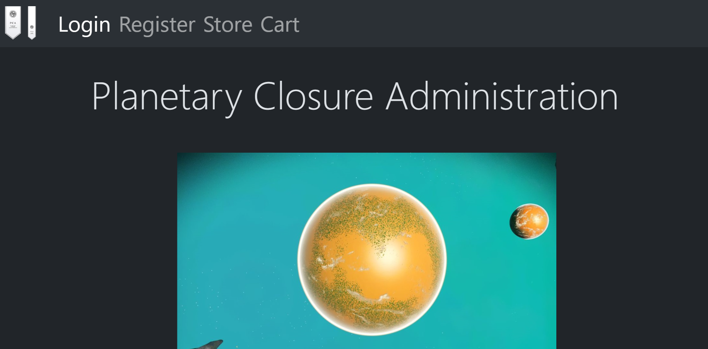
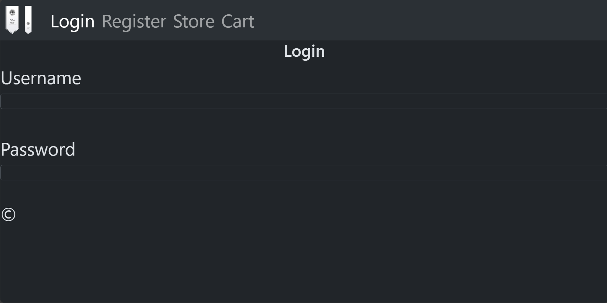
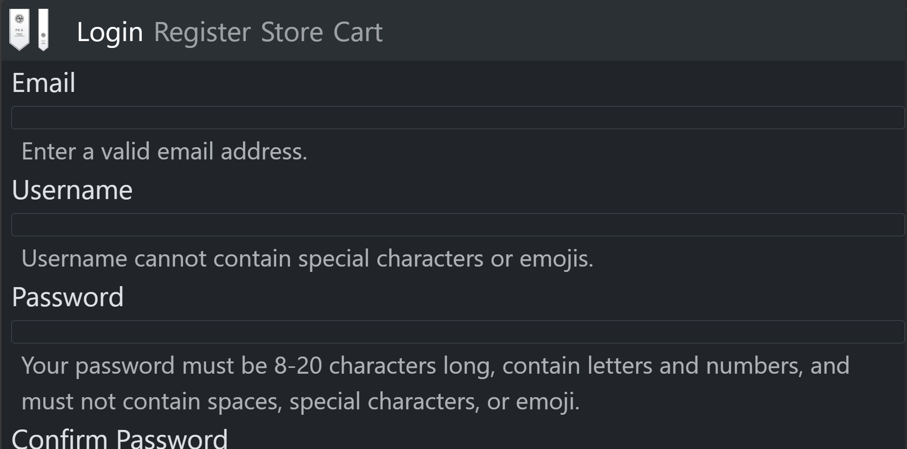
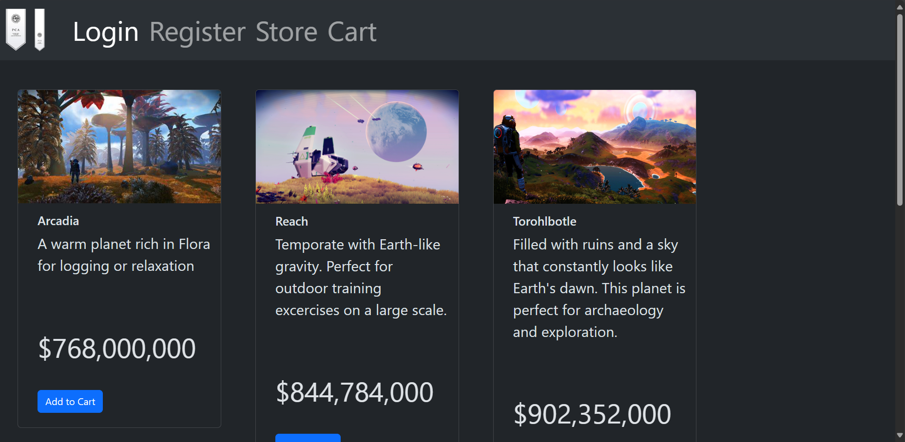
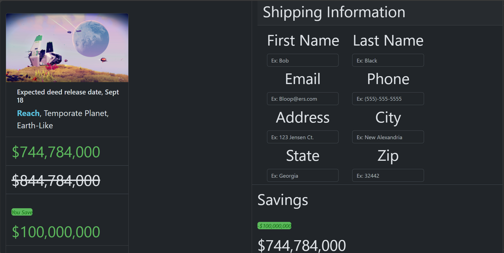

# Capstone1
For my website, I decided to use a fictional organization that sells planets.
The site has five distinct pages. A home page, login page, regitration page, store/products page, and a checkout page. A picture of each page is listed below.
- 
- 
- 
- 
- 
One interesting piece of html that I used was the lines that created the example item in the cart page. The code is as follows

> 

      
      

        <h5 class="card-title">Expected deed release date, Sept 18</h5>
        
<strong style="color: #5bc0de;">Reach</strong>, Temporate Planet, Earth-Like

      

      <ul class="list-group list-group-flush">
        <li class="list-group-item" style="color: #5cb85c;">$744,784,000</li>
        <li class="list-group-item"><s>$844,784,000</s></li>
        <li class="list-group-item" style="color: #5cb85c;"><em class="savings">You Save</em> $100,000,000</li>
      </ul>
      

        <button type="button" class="btn btn-danger">Remove</button>&nbsp; &nbsp;
        <button type="button" class="btn btn-primary">Save For Later</button>
      

    

I styled the div to include a remove and save for later button, as well as highlighting the savings in green.